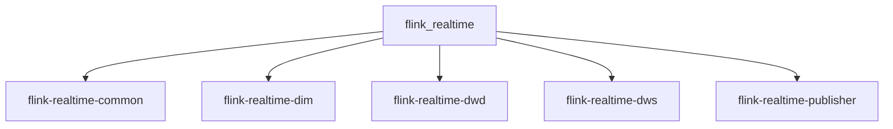

# Flink 实时数据处理平台

这是一个flink实施项目！包含了从ods到ads的处理，还有springboot和百度sugar的使用

## 🏗️ 项目结构


## 📂 项目结构
```text
flink_realtime/                          # 父项目（聚合模块）
├── flink-realtime-common/               # 公共工具模块
├── flink-realtime-dim/                  # 维度数据处理模块
├── flink-realtime-dwd/                  # 明细数据层处理模块
├── flink-realtime-dws/                  # 汇总数据层处理模块
└── flink-realtime-publisher/            # 数据发布模块
