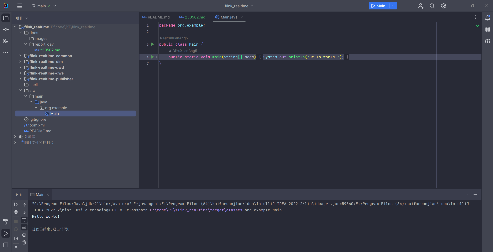
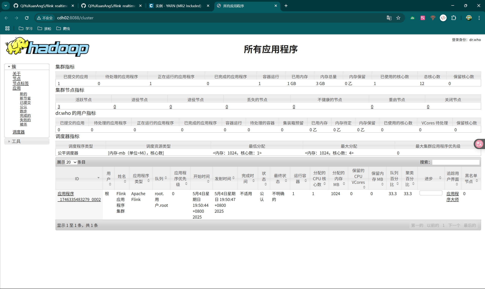
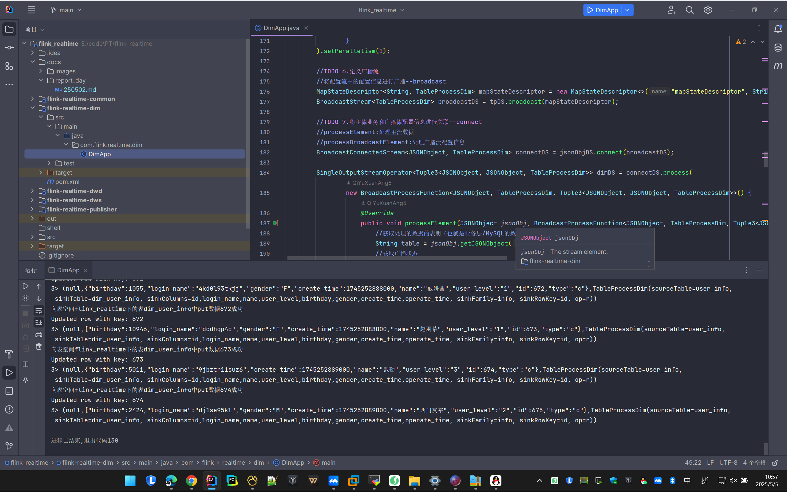
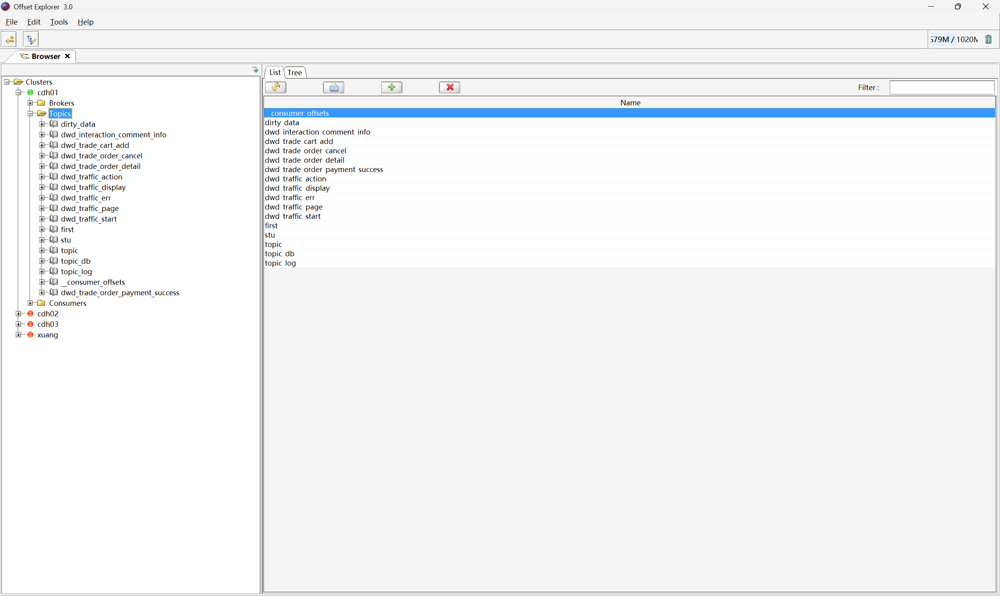
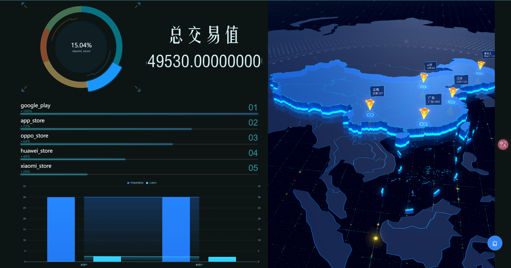
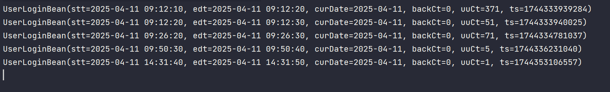
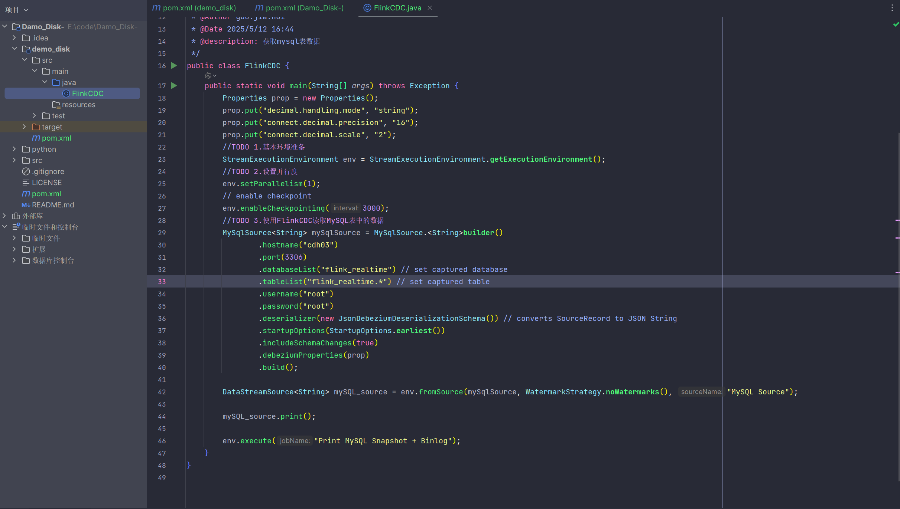

> 250502
* flink 代码处理 测试 提交
> 
* flink 代码处理 springboot层设置完成 百度sugar页面截图
> 

>250504
* flink 代码处理 项目提交到yarn
> 

>250505
* flink 代码处理 flink-realtime-dim模块里的DimApp类运行将数据写入到hbase中
> 
* 项目中产生的topic(工具:Offset Explorer 3.0)
> 

>250507
* flink实时项目fine_report看板效果
> 
* DWS层DwsUserUserLoginWindow类运行效果
> 
> 达摩盘分析.docx

>250512
> 